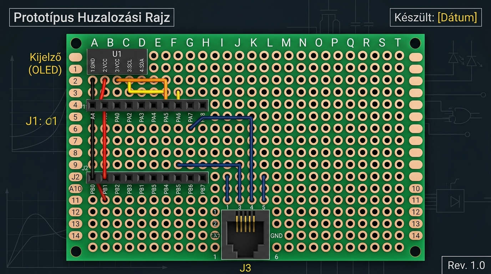

# ⚡ ESP32-C3 SuperMini – P1 Okosmérő (DSMR) & Telemetria Projekt

Ez a projekt egy teljes körű, élesben tesztelt és működő **ESP32-C3 SuperMini** okosmérő modul firmware és hardver specifikáció, amely fogadja az okos villanyórák (DSMR 4.x / 5.x) **P1 RJ12 csatlakozójának adatsorait**, elmenti a Wi-Fi és MQTT beállításokat, valamint folyamatosan sugározza a telemetriát a 24/7 futó **Raspberry Pi / Marcika szerverre**.



---

## 📑 Tartalomjegyzék
1. [Főbb Szoftveres Funkciók](#-főbb-szoftveres-funkciók)
2. [Hardver és Alkatrész Jegyzék](#-hardver-és-alkatrész-jegyzék)
3. [Valós NYÁK Szitázott Lábkiosztás (ESP32-C3 SuperMini)](#-valós-nyák-szitázott-lábkiosztás-esp32-c3-supermini)
4. [4x6 cm (22402A-18) NYÁK Panel Raszter Koordináta Térkép](#-4x6-cm-22402a-18-nyák-panel-raszter-koordináta-térkép)
5. [P1 RJ12 (6P6C) & CAT5 UTP Kábel Színkiosztás](#-p1-rj12-6p6c--cat5-utp-kábel-színkiosztás)
6. [Vezeték Nélküli Frissítés (OTA)](#-vezeték-nélküli-frissítés-ota)
7. [MQTT Telemetria & Távvezérlés](#-mqtt-telemetria--távvezérlés)
8. [Build és Feltöltés (PlatformIO)](#-build-és-feltöltés-platformio)

---

## 🚀 Főbb Szoftveres Funkciók

- ⚡ **P1 DSMR Okosmérő Olvasás:** Pillanatnyi fogyasztás (kW), összesített fogyasztás (kWh) és napelem visszatáplálás (kW) mérése hardveresen invertált soros porton (`GPIO3`, 115200 baud).
- 📶 **Dinamikus Multi-WiFi Kezelő:** Ubuntu stílusú vizuális Wi-Fi választó kártyalista `✓ KAPCSOLÓDVA` / `✓ ELMENTVE` jelvényekkel. Akár 10 különálló Wi-Fi hálózatot és jelszót ment el az NVS memóriába.
- 📡 **Dual Wi-Fi Mód (`WIFI_AP_STA`):** Saját Access Point (`ESP32-SuperMini` - `192.168.4.1`, jelszó: `12345678`) ÉS Otthoni Wi-Fi szimultán működése.
- 📲 **OTA Vezeték Nélküli Frissítés:** Webes `.bin` fájl feltöltő felület (`/update`) ÉS parancssori `ArduinoOTA` integráció.
- 🔌 **MQTT 24/7 Telemetria:** JSON adatküldés 5 másodpercenként a Raspberry Pi szerverre (`esp32c3/supermini/telemetry`) és távvezérlés az `esp32c3/supermini/cmd` csatornán.
- 🌡️ **Belső Chip Hőmérséklet Mérés:** Az ESP32-C3 beépített analóg hőmérőjének olvasása (`<driver/temp_sensor.h>`).
- 📺 **SSD1306 OLED Kijelző (128x64 I2C):** Valós idejű IP cím, P1 mérések, jelerősség és státusz megjelenítése.
- 🌐 **Élő Web Dashboard (UTF-8 + Auto-Refresh):** 3 szétválasztott oldal (`/` Élő adatok, `/settings` Beállítások, `/status` Rendszer státusz) 2 másodperces JSON auto-frissítéssel.

---

## 🛠️ Hardver és Alkatrész Jegyzék

| Alkatrész Neve | Típus / Specifikáció | Funkció / Feladat |
| :--- | :--- | :--- |
| **Mikrokontroller** | ESP32-C3 SuperMini (HESTORE `100.480.18`) | 160MHz RISC-V, 4MB Flash, Wi-Fi / BLE |
| **Kijelző** | SSD1306 0.96" OLED I2C (128x64) | Helyi státusz és P1 mérések kijelzése |
| **Kettős Tápdiódák** | **1N5822** (vagy 1N5819) Schottky Dióda | Tápvédelem a laptop USB és óra 5V között |
| **Húzóellenállás** | **4.7 kΩ** (0.25W) Resistor | P1 Data (`GPIO3`) jelvonal felhúzása 3.3V-ra |
| **Szűrőkondenzátor** | **10 nF** Kerámia Kondenzátor | EMI/RFI zajszűrés P1 Data (`GPIO3`) és GND között |
| **Prototípus NYÁK** | **4x6 cm (22402A-18)** Raszter NyÁK | Kompakt egybeépített hordozó panel |
| **Csatlakozók** | RJ12 6P6C aljzat & 1x8, 1x4 hüvelysorok | Moduláris csatlakozás |

---

## 📌 Valós NYÁK Szitázott Lábkiosztás (ESP32-C3 SuperMini)

A modolt felülről nézve (USB-C csatlakozóval felül):

```text
                 ESP32-C3 SuperMini (Nyák Szitázott Lábkiosztás)
                             +--------------+
             (OLED SDA) GPIO5| 1          9 |5V   (1N5822 Dióda Anód ➔ Katód)
             (OLED SCL) GPIO6| 2         10 |GND  (RJ12 Pin 3 & Pin 6)
             (P1 RTS)   GPIO7| 3         11 |3.3V (OLED VCC)
           (LED)        GPIO8| 4         12 |GPIO4 (Külső Gomb)
           (BOOT)       GPIO9| 5         13 |GPIO3 (P1 Data TxD)
                       GPIO10| 6         14 |GPIO2
                         RxD | 7         15 |GPIO1
                         TxD | 8         16 |GPIO0
                             +--------------+
```

---

## 📐 4x6 cm (22402A-18) NYÁK Panel Raszter Koordináta Térkép

A NyÁK lapot úgy tartva, hogy fent van az 1-es sor (A-T oszlopok):

#### 1. Bal Oldali 1x8 Hüvelysor ➔ **4-es Sor (A – H oszlopok)**
- **4A (`GPIO5`):** ➔ **8K (OLED SDA)**
- **4B (`GPIO6`):** ➔ **7K (OLED SCL)**
- **4C (`GPIO7`):** ➔ **RJ12 Pin 2 (RTS)**
- **4D-4H:** *(Szabad lábak / BOOT / LED)*

#### 2. Jobb Oldali 1x8 Hüvelysor ➔ **10-es Sor (A – H oszlopok)**
- **10A (`5V`):** ➔ **1N5822 Schottky Dióda KATÓD (csíkos oldal)** *(Anód ➔ RJ12 Pin 1 +5V)*
- **10B (`GND`):** ➔ **Közös Föld Sík** *(OLED GND 6K, RJ12 Pin 3/6, 10nF Kondenzátor)*
- **10C (`3.3V`):** ➔ **OLED VCC 5K** & **4.7 kΩ Pull-Up Ellenállás egyik lába**
- **10D (`GPIO4`):** ➔ **Külső Gomb egyik lába** *(másik láb GND-re)*
- **10E (`GPIO3`):** ➔ **RJ12 Pin 5 (Data)** + **4.7 kΩ Ellenállás** + **10nF Kondenzátor**

#### 3. OLED Kijelző Hüvelysor ➔ **K-Oszlop (5. – 8. sorok)**
- **5K (OLED VCC):** ➔ **10C (`3.3V`)**
- **6K (OLED GND):** ➔ **10B (`GND`)**
- **7K (OLED SCL):** ➔ **4B (`GPIO6`)**
- **8K (OLED SDA):** ➔ **4A (`GPIO5`)**

---

## 🎨 P1 RJ12 (6P6C) & CAT5 UTP Kábel Színkiosztás

| RJ12 Pin | RJ12 Jel | CAT5 UTP Szín | ESP32-C3 SuperMini Lábszám & Név |
| :---: | :--- | :--- | :--- |
| **Pin 1** | `+5V VCC` | 🟠 **Tömör Narancs** | **1N5822 Dióda Anód** ➔ ESP32 `5V` (10A) |
| **Pin 2** | `RTS (Data Request)` | 🔵 **Tömör Kék** | **Bal 3-as láb (`GPIO7` - 4C)** |
| **Pin 3** | `Data GND` | ⚪🟢 **Zöld-Fehér** | **Jobb 10-es láb (`GND` - 10B)** |
| **Pin 4** | `N.C.` | ⚪🟠 *(Narancs-Fehér)* | *Nincs bekötve* |
| **Pin 5** | **`Data (TxD)`** | 🟢 **Tömör Zöld** | **Jobb 13-as láb (`GPIO3` - 10E)** *(4.7kΩ + 10nF)* |
| **Pin 6** | `Power GND` | ⚪🔵 **Kék-Fehér** | **Jobb 10-es láb (`GND` - 10B)** |

---

## 📲 Vezeték Nélküli Frissítés (OTA)

A firmware támogatja a vezeték nélküli frissítést:
1. **Webes frissítés:** Nyisd meg a `http://192.168.0.239/update` oldalt és tallózd be a `.pio/build/esp32-c3-supermini/firmware.bin` fájlt.
2. **PlatformIO CLI:**
   ```bash
   pio run -t upload --upload-port 192.168.0.239
   ```

---

## 🛠️ Build és Feltöltés (PlatformIO)

```bash
# Firmware fordítás és feltöltés USB-n keresztül
pio run -t upload --upload-port /dev/ttyACM0

# Soros port napló olvasása
pio device monitor -b 115200
```
