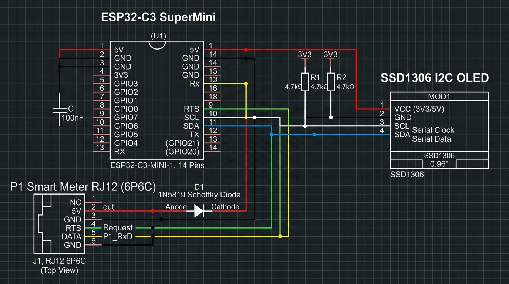

# ⚡ ESP32-C3 SuperMini – P1 Okosmérő (DSMR) & Telemetria Projekt

Ez a projekt egy teljes körű **ESP32-C3 SuperMini** firmware, amely fogadja az okos villanyórák (DSMR 4.x / 5.x) **P1 RJ12 csatlakozójának adatsorait**, elmenti a Wi-Fi és MQTT beállításokat, valamint folyamatosan sugározza a telemetriát a 24/7 futó **Raspberry Pi / Marcika szerverre**.



---

## 🚀 Főbb Funkciók

- ⚡ **P1 DSMR Okosmérő Olvasás:** Pillanatnyi fogyasztás (kW), összesített fogyasztás (kWh) és napelem visszatáplálás (kW) mérése hardveresen invertált soros porton (`GPIO3`).
- 📶 **Dinamikus Wi-Fi Kezelő (Multi-WiFi):** Ubuntu stílusú vizuális Wi-Fi választó kártyalista `✓ KAPCSOLÓDVA` / `✓ ELMENTVE` jelvénnyel. Akár 10 különálló Wi-Fi hálózatot is elment az NVS memóriába.
- 📡 **Dual Wi-Fi Mód (`WIFI_AP_STA`):** Saját Access Point (`ESP32-SuperMini` - `192.168.4.1`) ÉS Otthoni Wi-Fi szimultán működése.
- 🔌 **MQTT 24/7 Telemetria:** JSON adatküldés 5 másodpercenként az `esp32c3/supermini/telemetry` topikra és távvezérlés az `esp32c3/supermini/cmd` csatornán.
- 🌡️ **Belső Chip Hőmérséklet Mérés:** Az ESP32-C3 beépített analóg hőmérőjének olvasása (`<driver/temp_sensor.h>`).
- 📺 **SSD1306 OLED Kijelző (128x64 I2C):** Valós idejű IP cím, P1 mérések, jelerősség és státusz megjelenítése.
- 🌐 **Élő Web Dashboard (UTF-8 + Auto-Refresh):** 3 szétválasztott oldal (`/` Élő adatok, `/settings` Beállítások, `/status` Rendszer státusz) 2 másodperces JSON auto-frissítéssel.

---

## 🔌 P1 RJ12 (6P6C) Bekötési Kiosztás

```text
       RJ12 (6P6C) CSATLAKOZÓ (Műanyag pöcök LEFELÉ néz)
          +---+---+---+---+---+---+
          | 1 | 2 | 3 | 4 | 5 | 6 |
          +---+---+---+---+---+---+
            |   |   |   |   |   |
           +5V RTS GND N.C. RxD GND
```

| RJ12 Pin | Jel Neve | Dióda / Ellenállás | ESP32-C3 Lábra Kötendő | Megjegyzés |
| :---: | :--- | :--- | :--- | :--- |
| **Pin 1** | `+5V VCC` | **1N5819 Schottky Dióda** *(Anód ➔ RJ12, Katód ➔ ESP32)* | **`5V` láb** | Biztonságos kettős tápellátás *(Óra táp + Laptop USB egyszerre)* |
| **Pin 2** | `Data Request (RTS)` | Közvetlen vezeték | **`GPIO7` láb** | Adatkérő kimenet *(HIGH / 3.3V)* |
| **Pin 3** | `Data GND` | Közvetlen vezeték | **`GND` láb** | Közös földelés / test |
| **Pin 4** | `N.C.` | - | *Nincs bekötve* | Szabadon hagyandó |
| **Pin 5** | **`Data (TxD)`** | 4.7 kΩ Pull-Up (3.3V felé) | **`GPIO3` láb** | Hardveresen invertált soros adatsor *(115200 baud)* |
| **Pin 6** | `Power GND` | Összekötve Pin 3-mal | **`GND` láb** | Közös földelés / test |

---

## 📺 OLED & Gomb Bekötés

- **OLED VCC:** `3.3V`
- **OLED GND:** `GND`
- **OLED SDA:** `GPIO5`
- **OLED SCL:** `GPIO6`
- **Fedélzeti LED:** `GPIO8` *(Active LOW)*
- **Fedélzeti BOOT Gomb:** `GPIO9`
- **Külső Gomb:** `GPIO4`

---

## 🛠️ Build és Feltöltés (PlatformIO)

```bash
# Firmware fordítás és feltöltés
pio run -t upload --upload-port /dev/ttyACM0

# Soros port napló olvasása
pio device monitor -b 115200
```
